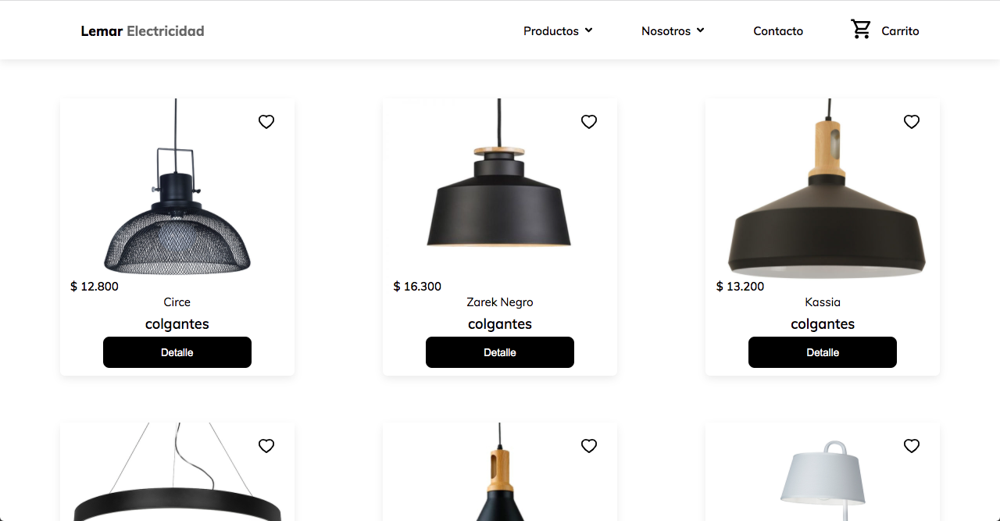

# Proyecto e-commerce :computer:
E-commerce desarrollado en React para fábrica de luminarias.

## Link al e-commerce:
- [Lemar Electricidad](https://lemarelectricidad.netlify.app/)

### Navegacion
- Home con productos.
- Navegacion por categoria de productos.
- Pantalla de detalle de productos.
- Carro de compras con los items seleccionados.


La app permite ver el catálogo, y navegar al  detalle del producto.

## Desarrollado con :wrench:
- [React](https://es.reactjs.org/)
- [Vite](https://vitejs.dev/)
- [React Icons](https://react-icons.github.io/react-icons/)
- [React Router](https://reactrouter.com/)
- [Firebase](https://firebase.google.com/)

### Intalación

En el directorio del proyecto se debe ingresar en la consola:
```
 npm run dev
```
De esta forma se inicia en forma local y se puede acceder en http://localhost:3000 para verlo en el navegador.

### Vista previa


